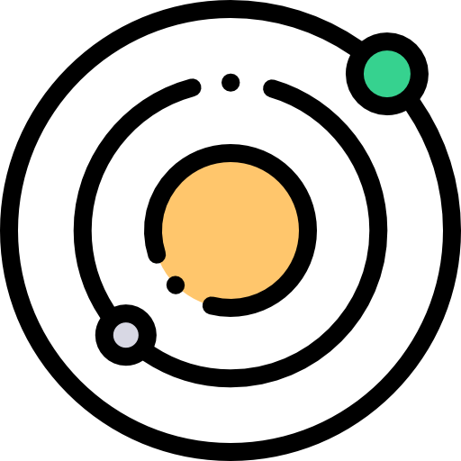

# Gravity Simulation
#### powered by PhEngineV2, on Python
###### version 2.4.2

\
ㅤ
### Introduction
This project simulates the effects of gravity on objects using formulas and calculations of the real world. It provides a visual representation of the movement of objects under the influence of gravity.
### Features
**Creating objects**: Create objects with different masses and initial velocities.\
**Gravity Simulation**: Simulate the gravitational force between objects.\
**Motion Visualization**: Visualize the movement of objects in a _2D environment_.\
**Realistic Physics**: Use real-world formulas, such as Newton's law of _universal gravitation_, to calculate the forces and trajectories of objects.
### More Detailed
Main language still is **Python**, it is used for [calculate gravity force](PhEngineV2/space/phisic.py) or [data organization](PhEngineV2/space/scene.py)\
The difference between this version and the previous one is in its greater degree of completeness. The principles of the engine have been changed, new camera capabilities have been added, the simulation itself and calculations in the engine have been optimized. In addition, work has begun on shaders and the engine interface. In this version of the application, new methods of data storage, loading and use were used, and data is meant not only for saving, but also for configuration. Got a new presets structure\
the [error screen](PhEngineV2/messages/err_screen.py) is available to the user, which will appear if one occurs
### Using
Write the object parameters in the `.syssav` file according to the format: `ObjectType|name|position|speed|mass|size|color(in RGB)`
When creating an object, two-dimensional vectors are used _(specifically in position, speed, size)_. All data should be indicated in real physical measures (in the Measurement System)
after each change, I advise you to run it before starting translate_sav.py the file according to your text saving

### requirements:
The project uses different libraries and frameworks, here is a list of them
- standard libraries:
  * pickle;
  * pprint;
  * collections;
  * time;
  * random;
  * copy;
  * ctypes;
  * abc;
  * os;
  * typing;
  * dataclasses;
  * sys;
  * traceback;
  * inspect;
  * pathlib;
- frameworks:
  * PyGlm;
  * PyGame;
  * Kivy;
  * Loguru;
  * Toml;

### Compilation
to fully compile the files, you need the command: `pyinstaller --windowed --icon="core\presets\textures\GravitySimulation.ico" --name="Gravity Simulation 2" main.pyw`. After executing the command in the local console for your project, you need to transfer all the data, these are pictures, music and a save file, also do not forget to transfer core/planet.py . This module is almost not imported anywhere, although it must be present in the core folder for proper operation
don't forget that you need the pyinstaller library `pip install pyinstaller` to compile
you also need to know that when compiling the game, the files responsible for the engine and the developments of its interface will not be compiled, and unittest will not be used in any way in the compiled version, so far they work only from code
[these files should be present in the directory with the compiled simulation](GameData/screenshots/data_from_compile_files.png)

#### screenshots:
[save text file - core mechanics](GameData/screenshots/syssav.png)\
[a text and binary save file having the same data](GameData/screenshots/gs+syssav.png)\
[Loading the simulation - core mechanics](GameData/screenshots/loading.png)\
[in the main menu](GameData/screenshots/inapp.png)